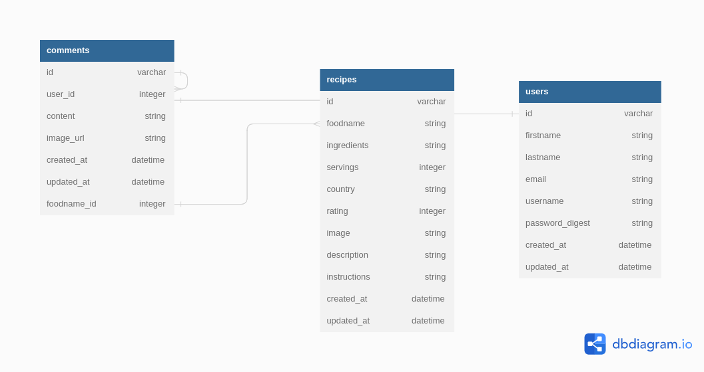

# ReCipe
---
# Cooks Create
This project is being developed and maintained by:
* Allan Kiprop - Back End Developer
* Douglas Obara - Front End  Developer
* Precious Omondi - Front End Developer
* Nicholas Kipkirui - Back End Developer
* Harrison Omondi - Front End Developer
* Maryanne Onyango - Back End developer
---
## Description
ReCipe is an app that allows users to view, add, delete, update and comment on recipes, be it their own or those created by other users. Users can also view other users' recipes and comment on them. Users also have the ability to share their favortie recipes with other users via social media platforms.
---
## Setup/Installation Requirements
```
Fork/Clone this repository to your local machine.(https://github.com/sang-4/recipe-app-API)
& cd into the project folder
& Run bundle install to install all dependencies
& Run rails server to run the database on localhost
& preferably use nvm v16
```
---
# Frontend
*Frontend repo (https://github.com/sang-4/recipe-app)
## Known Bugs
There are no known bugs at the moment. If you encounter any, please contact us.
---
## Technologies Used
* HTML
* CSS
* JavaScript
* React
* Redux
* Ruby on Rails(API)
* PostgreSQL
* Heroku
* Postman
---
## Support and contact details
If you have any issues, questions, ideas or concerns, please contact us at:
recipe.app@gmail.com

## Relationships
ERD - Live [link](https://dbdiagram.io/d/635bbb065170fb6441b08642)


---
## License
MIT License
---